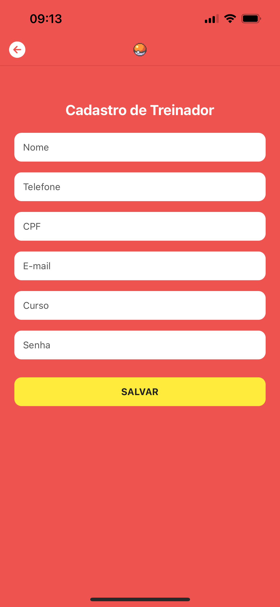
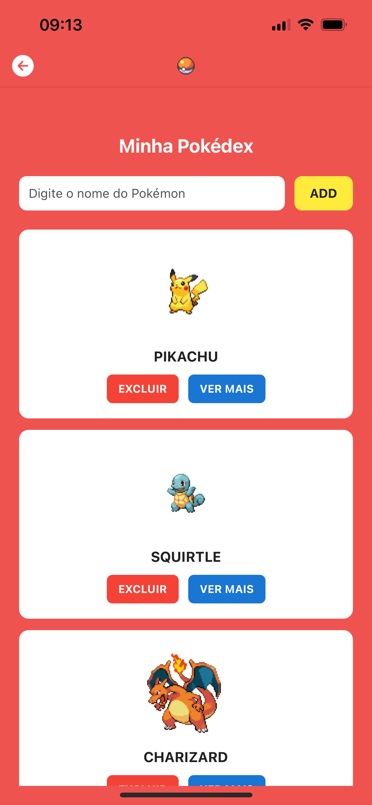
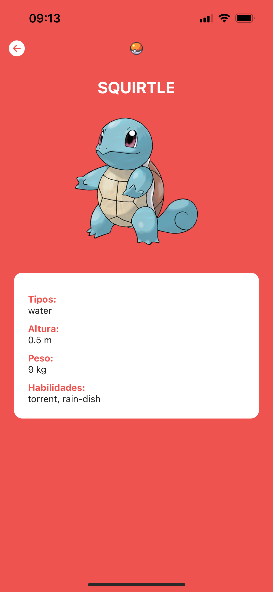

# 📱 Pokédex - Projeto React Native (1º Bimestre)

Aplicativo desenvolvido para a disciplina de Desenvolvimento Mobile da FATEC Franca.  
Feito com **React Native + Expo**, inspirado na **Pokédex** do anime Pokémon e utilizando a **PokéAPI**.

---

## 🧠 Objetivo

Criar um app mobile com as seguintes funcionalidades:

- Tela de **Login**
- Tela de **Cadastro de usuário**
- Tela de **Cards** com Pokémons buscados pela API
- Tela de **Detalhes** com informações completas do Pokémon

---

## 🚀 Tecnologias utilizadas

- [React Native](https://reactnative.dev/)
- [Expo](https://expo.dev/)
- [React Navigation](https://reactnavigation.org/)
- [AsyncStorage](https://react-native-async-storage.github.io/async-storage/)
- [Axios](https://axios-http.com/)
- [PokéAPI](https://pokeapi.co/)

---

## 📸 Imagens do App

| Login | Cadastro |
|-------|----------|
|  |  |

| Cards | Detalhes |
|-------|----------|
|  |  |

---

## 📦 Instalação

### 1. Clone o repositório

```bash
git clone https://github.com/pblcnr/pokedex-api.git
cd pokedex-api
```

### 2. Instale as dependências
```bash
npm install
```

### 3. Rode o Projeto
```bash
npx expo start
```

Use o app do Expo no seu celular para escanear o QR Code e testar.

## 🔐 Telas e Funcionalidades

### 🔑 Login

- Campos: E-mail e Senha
- Validação dos dados com AsyncStorage
- Navega para a tela de Cards

### 📝 Cadastro

- Campos: Nome, Telefone, CPF, E-mail, Curso, Senha
- Salva os dados localmente com AsyncStorage
- Redireciona para Login após cadastro

### 🎴 Cards
- Busca Pokémons pelo nome via PokéAPI
- Exibe nome, imagem e botões:
    - ❌ Excluir
    - 🔍 Ver mais detalhes
- Salva os Pokémons adicionados localmente com AsyncStorage

### 📋 Detalhes
- Mostra dados como:
    - Nome
    - Tipos
    - Altura, Peso
    - Habilidades
    - Imagem oficial do Pokémon

## 👨‍💻 Desenvolvedor
- Paulo Henrique Borges de Andrade Filho

## 💡 Créditos
Pokémons e dados fornecidos pela [PokéAPI](https://pokeapi.co/).

Inspirado no anime **Pokémon** e na **Pokédex** original.

___